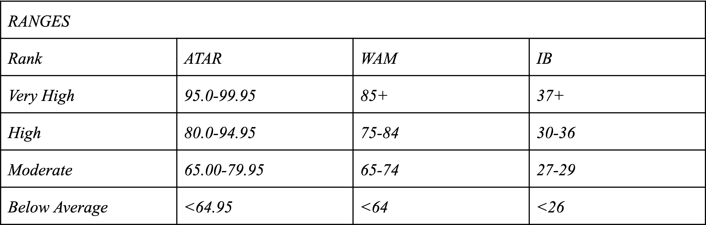

<br>

[Survey Link](https://www.surveymonkey.com/r/D7Y9PX2) 

<br>

# Executive Summary  

<br>

This report provides an analysis and evaluation of the multitude of interacting factors affecting the academic performance of university students. The conduction of a contemporaneous, observational study allowed for an ethical and reliable examination of participant’s unique lifestyle behaviours and tendencies which hold the potential to directly affect their capacity to perform optimally at a high level. Its distribution was carried out via a voluntary survey to the diverse student body of the University of Sydney, though the data extracted is only relative to that of the participants who compose the observational study’s sample data of the population.

Moreover, the study’s findings concluded a direct association between an individual’s evaluation of their level of motivation and their academic performance. Whilst contrastingly disproving the preconceived connection between academic achievement and the amount of hours invested towards study. Additionally, the presence of a variety of confounding and interacting were identified throughout the course of undergoing the study, and the potential impacts to the aforementioned conclusions were identified.

<br>

# Full Report

<br>

## Initial Data Analysis (IDA)

***  

```{r, include=FALSE}
# Run packages
library("tidyverse")
library(ggplot2)
```

```{r, echo=FALSE}
## Load data
students = read.csv("data/DataAtarOnly.csv", header = T)
ATAR = students$ATAR
study = students$StudyHours
sleep = students$SleepHours
activity = students$ActivityHours
motivation = students$Motivation
health = students$Health
```

### Source of Data  

<br>

#### Size of Data

```{r, echo=FALSE}
## Size of data
dim(students)
```

<br>

#### Classification of Relevant Variables Via Structure

```{r, echo=FALSE}
substudents = students[6:11]
str(substudents)
```

<br>

The respondent data was extracted from an online survey, consisting of ten questions established by our team of surveyors. The survey, created with SurveyMonkey.com, was distributed to the USYD Discussion Group (14,000+ members) via a link. After the 36th response, the survey was closed and no further data was considered in the analysis.

<br>

##### Ethics:
* Details that identified respondents were not collected during the survey, and therefore were not divulged to the surveyors.
* The questions were not obtrusive or offensive, nor did they ask for sensitive information from the respondents. 

##### Reliability/ bias:
* 36 respondents is a small sample size, a questionable representation of the much larger University Student population.
* The anonymous partaking of the survey subjects prompted little to no risk of selection bias.
* Coverage bias was apparent as certain student groups were provided the survey link; thus not depictive of the whole of the University Student population.
* Ultimately, coverage bias was apparent as there was an over-representation of domestic and female subjects. Again, not representative of the population.
* A minor portion of the entries yielded suspicious or nonsensical data.
* The observational study is contemporaneous, therefore all data is current and reliable for reference. 

##### Limitations :
* We defined score thresholds to categorise the different measures of academic performance (ATAR, WAM, IB). An absence of a standardised method made the comparison of performance data complicated. 
* The academic performance data was a reflection of what the students had achieved in the previous year. Whereas, the data that corresponded as the source of their performance was assumed to be present behaviour of the participants. This may cause a discrepancy between past and projected performance of the students.
* The subjects were responsible for their interpretation of questions that prompted answers using a likert scale. As a result, we were prone to receiving subjective answers that were not quantifiable with precision.
* The presence of confounding variables and interacting variables had hidden implications.

<br>

 
*Figure 1.1*

<br>

```{r, echo=FALSE}
atarhist = ggplot(data=students, aes(x=ATAR))
atarhist = atarhist + geom_histogram(breaks=seq(65, 100, by = 5), binwidth = 5, color="black", fill="#619CFF") + theme_minimal() 
atarhist = atarhist + ggtitle("Frequency Distribution of Student ATAR Scores") + ylab("Number of Students")
atarhist = atarhist + theme(plot.title = element_text(hjust = "0.5", face = "bold"))
atarhist = atarhist + geom_vline(aes(xintercept=mean(ATAR)), color="black", linetype="dashed", size=0.5)
atarhist
```
*Histogram 1.1*

<br>

***  
### Complexity of Data & Classification of Variables

<br>

##### Numerical summary of ATAR data
```{r, echo=FALSE}
summary(ATAR)
```
*Numerical Summary 1.1*

<br>

##### Numerical summary of motivation levels of students with an ATAR equal to or above 85
```{r, echo=FALSE}
summary(motivation[ATAR>=85])
```
*Numerical Summary 1.2*

<br>

##### Numerical summary of motivation levels of students with an ATAR below 85
```{r, echo=FALSE}
summary(motivation[ATAR<85])
```
*Numerical Summary 1.3*

<br>

##### Numerical summary of study hours of students with an ATAR above 85
```{r, echo=FALSE}
study = factor(study, levels=c("< 5", "5 - 10", "10 - 20", "20 - 30", "30 - 40"))
summary(study[ATAR>=85])
```
*Numerical Summary 1.4*

<br>

***  
### Stakeholders

<br>

Observational studies hold the potential to serve as valuable tools for large corporations to extract insightful data about their consumers. Our project may act as a valuable resource to inform and assist a variety of stakeholders. 

Firstly, key contributors/participants in the survey may exhibit an interest in the results as they have had a direct contribution to the report. Additionally, the wider university community may be interested due to the factors’ relevancy to their personal academic performance. Similarly, educational institutions and academics may be interested in our project as it provides valid insight into the direct relationship between a student’s lifestyle choices and their current/projected academic achievement. Which may inform decisions surrounding resource allocation and distribution.  

<br>

## Can an individual's perception of their level of motivation directly impact their academic performance?

<br>

An individual's level of motivation signifies the desire they have to perform well in their studies. The data from the study were able to associate a relationship between an individual's self-evaluated motivation level and academic performance. In summary, the results show that a university student's perceived motivation holds significant potential in influencing their capacity to perform at a high level.

<br>

```{r, echo=FALSE}
motivationscatter = ggplot(students, aes(x=motivation, y=ATAR))
motivationscatter = motivationscatter + geom_point(size=2, colour = "#619CFF") + theme_minimal()
motivationscatter = motivationscatter + ggtitle("Student ATAR vs Perceived Motivation Level") + xlab("Motivation Rating") + ylab("ATAR")
motivationscatter = motivationscatter + theme(plot.title = element_text(hjust = "0.5", face = "bold"))
motivationscatter
```
*Scatterplot 1.1*

<br>

This association is substantiated by the data collected in our survey. As seen in *Scatterplot 1.1*, Students who achieved a *"very high"* ranking of academic achievement, showcase a higher personal rating of their motivation when compared to the students of lower rankings. Subsequently, it is assumed that these better-performing students engage in their studies with a higher degree of enthusiasm and determination, resulting in better grades. In addition, a higher level of motivation may be driven by a purpose to pursue high grades, such as a lucrative career or a personal sense of accomplishment. This underlying cause may assist the student in persevering and overcoming the hardships of rigorous education.

Moreover, participants that were shown to achieve a *"below average"* ranking of academic achievement exhibited a low average personal ranking of their motivation level *(see Scatterplot 1.1)*. Given that an individual's motivation is determined intrinsically, these students have potentially failed to identify a personal reward for performing well. A further explanation is given by Charles Gbollie whose research claims,

> Intrinsic goal orientation and self-efficacy for learning and performance were all positively correlated with organization, critical thinking, time and study environment management, and peer learning and help seeking strategies (Gbollie, 2020).

As such, this lack of motivation is reflected in study habits and thus, final scores.

Furthermore, from our findings, the conclusion can be drawn that high performing university students exhibit a promising level of motivation (*"4 - I'll happily try and get the work done to a high standard"*). This result may reflect the student's aspirations, as well as a variety of other motivating determinants (both intrinsic and extrinsic) that manifest into better academic performance. Consequently, an association between a university student's perception of their motivation level and academic achievement is established.

<br>

***

## Is the academic performance of university students influenced by the amount of hours dedicated towards study?

<br>

The academic performance of individuals enrolled in university is multifactorial, in that there are a variety of determinants that may influence their capacity to perform at an optimal level. Through the study we were able to disassociate a connection between academic performance and the amount of hours invested towards study. From the data, we can draw conclusions regarding the trends in relation to the link between study hours and academic achievement. 

<br>

```{r, echo=FALSE}
study = factor(study, levels=c("< 5", "5 - 10", "10 - 20", "20 - 30", "30 - 40"))

studybox = ggplot(data=students, aes(x=study,y=ATAR))
studybox = studybox + geom_boxplot(fill = "#619CFF", outlier.colour = "#619CFF", outlier.size = 3) + theme_minimal()
studybox = studybox + ggtitle("Student ATAR vs Study Hours") + xlab("Study Hours Per Week") + ylab("ATAR")
studybox = studybox + theme(plot.title = element_text(hjust = "0.5", face = "bold"))
studybox
```
*Boxplot 1.1*

<br>

This notion is explored through students who achieved a *“very high”* ranking of academic achievement, recording the lowest amount of hours dedicated towards study per week. This can be seen by referring to *Boxplot 1.1* and *Numerical Summary 1.4*. Subsequently, this conflicts with our initial theory, which assumed that exceptional results would indicate a higher volume of time dedication towards study. When in fact, it may be inferred from the data that the trend of *“very high”* academic performance occurs as a result of circumstances that are unique to the study’s participants. For example, the students who spent the most time on extracurricular activities, were among the highest achieving in the group, as seen in *Boxplot 1.2*. Additionally, our data does not convey the fact that individual determinants such as personality/attitude may serve to enhance academic performance unlike the amount of hours dedicated to study. Furthermore, this disproves the association of the amount of dedicated study hours to an individual’s level of academic achievement, though this result is limited to the participants who compose the study’s sample data.

<br>

```{r, echo=FALSE}
activity = factor(activity, levels=c("0", "1 - 5", "5 - 10", "10 - 20", "20 - 30", "> 30"))

activitybox = ggplot(data=students, aes(x=activity,y=ATAR))
activitybox = activitybox + geom_boxplot(fill = "#619CFF", outlier.colour = "#619CFF", outlier.size = 3) + theme_minimal()
activitybox = activitybox + ggtitle("Student ATAR vs Hours Spent on Extracurricular Activities") + xlab("Activity Hours Spent Per Week") + ylab("ATAR")
activitybox = activitybox + theme(plot.title = element_text(hjust = "0.5", face = "bold"))
activitybox
```
*Boxplot 1.2*

<br>

Perhaps more astounding from the results, is that individuals who achieved a *“below average”* ranking of academic achievement displayed a higher average amount of study-related hours than those of *“very high”* achieving students. The magnitude of this finding is evident in *Boxplot 1.1* where the group that studies 30 - 40 hours per week is largely students who underperform relative to their peers. Consequently, this contradicts the claim that greater study hours equate to better results. Moreover, individual performance may be influenced by other determinants which act as confounders in our study; including, but not limited to, external study assistance, levels of natural intelligence, or the effectiveness/efficiency of their study sessions. 

To summarise our findings, an individual’s time commitment to study is not indicative of their capacity to perform at a higher level, as explored through the findings of the *“very high”* and *“below average”* ranked individuals, whose data proved this to be a fallacy. 

<br>

***

# References

<br>

* Gbollie, C. (2017). Student Academic Performance: The Role of Motivation, Strategies, and Perceived Factors Hindering Liberian Junior and Senior High School Students Learning. Education Research International.

<br>
